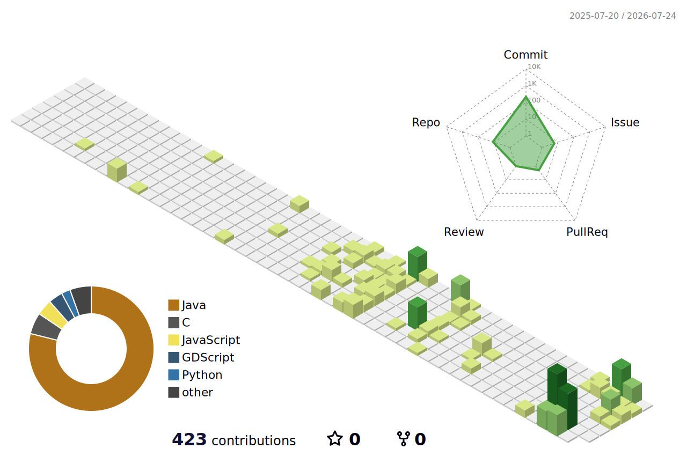

<div align="center">

# Gavin Chen

```txt
┌──────────────────────────────────────────────┐
│  Programming Lead @ FRC 2204 Rambots         │
│  Java · Kotlin · Python · robots · silicon   │
└──────────────────────────────────────────────┘
```


</div>

---

## whoami

```yaml
name: Gavin Chen
role: Programming Lead
team: FRC 2204 Rambots

speaks:
  - Java
  - Kotlin
  - Python
  - JavaScript

learning:
  - C++ / Verilog (down to the silicon)
  - control theory (FOC, PID, state-space)

interests:
  - robotics
  - embedded + hardware
  - AI / computer vision
  - CAD
  - Valorant

status: "The robot was working yesterday."
```

---

## Tech stack

<p align="center">

</p>

<p align="center">


</p>

---

## In the lab &nbsp;`[ WIP ]`

```txt
▸ cable-robot     4-winch robot that goes around a claw around a room to grab
                  things — ESP32 + steppers, OpenCV AprilTag closed loop.

▸ couch-ev        a self-propelled electric couch running a from-scratch
                  field-oriented BLDC motor controller (KiCad board + firmware).

▸ tiny-tapeout    a custom digital chip headed to real silicon —
                  Verilog → OpenLane → Skywater 130nm.
```

## Shipped

- **[frc-2025-simulation](https://github.com/ggkchen/frc-2025-simulation)** — FRC robot simulation
- **[bot-slacking-off](https://github.com/ggkchen/bot-slacking-off)** - Slack bot online 24/7 that sends animal pictures and jokes
- **[krackenmusic](https://github.com/ggkchen/krackenmusic)** — playing music on Kraken motors
- **[Daydream](https://github.com/ggkchen/Daydream)** — a game, in Godot / GDScript
- **[gavpad](https://github.com/ggkchen/gavpad)** — custom keyboard / macropad

---

## Commit hall of shame

<!--START_SECTION:shame-->
> `added floor to test`
>
> a randomly resurfaced sin from my git history
<!--END_SECTION:shame-->

---

## Current side quests

```txt
Robotics        ██████████████░░░░
Silicon         ██████████░░░░░░░░
Kotlin          ████████████░░░░░░
Computer Vision ███████████░░░░░░
Sleep           ██░░░░░░░░░░░░░░░░
```

## Robot telemetry

```txt
Battery        ████████░░ 80%
Motors         ██████████ 100%
Code Quality   ██████░░░░ 60%
Driver Skill   █████████░ 90%
Bug Count      ███████████████████████
```

## Hardware status

```txt
Motherboard    Gave mother something to do
CPU            Overthinking
RAM            Full
Storage        Full
Programmer     Also full
```

## AI project status

```txt
Prompt Quality     ████████░░
Model Accuracy     ███████░░░
Hallucinations     ██████████
```

## Valorant.exe

```txt
ROLE     Programmer
MAIN     Depends on the patch notes
AIM      Improving
PING     Too high
EXCUSES  Unlimited
RANK     IMMORTAL III · 278RR
```

## Top 3 enemies

```txt
1. NullPointerException
2. Merge conflicts
3. "It worked yesterday"
```

## Favorite error message

```java
java.lang.NullPointerException
```

---

## Weekly coding breakdown

_What I've actually been typing this week (auto-updated by WakaTime — Java, Kotlin, and the occasional YAML fight)._

<!--START_SECTION:waka-->
This section fills in once WakaTime is connected and I've logged some coding time. Check back after the first Action run.
<!--END_SECTION:waka-->

---

## Stats

<p align="center">


</p>

<p align="center">

</p>

<p align="center">

</p>

<!-- Contribution snake — powered by the workflow in .github/workflows/snake.yml -->
<p align="center">
<picture>
  <source media="(prefers-color-scheme: dark)" srcset="https://raw.githubusercontent.com/ggkchen/ggkchen/output/github-snake-dark.svg" />
  
</picture>
</p>

<!--START_SECTION:contribution-universe-3d-->
## Contribution universe

<div align="center">

<!-- Generated daily by the github-profile-3d-contrib Action. Images 404 until the first run finishes. -->
<picture>
  <source media="(prefers-color-scheme: dark)" srcset="./profile-3d-contrib/profile-night-rainbow.svg">
  <source media="(prefers-color-scheme: light)" srcset="./profile-3d-contrib/profile-green-animate.svg">
  
</picture>

<sub>Robots by day, committing by night. Rebuilt daily.</sub>

</div>
<!--END_SECTION:contribution-universe-3d-->

## 📊 Metrics

<div align="center">

<!--
  Rendered by lowlighter/metrics via .github/workflows/metrics.yml.
  NOTE: this image 404s until the first successful Actions run creates github-metrics.svg.
-->


</div>

---

<div align="center">

</div>

---

## 🎮 Play tic-tac-toe against my repo

You're **X**. Click a square — GitHub opens a pre-filled issue that casts your move, and my repo plays back as **O** within about a minute. No account tricks, no build required (unlike most of our robots).

<!--START_SECTION:ttt-->
|  |  |  |
|:-:|:-:|:-:|
| [&nbsp;⬜&nbsp;](https://github.com/ggkchen/ggkchen/issues/new?title=ttt%7Cmove%7C0&body=Casting%20my%20tic-tac-toe%20move%20as%20X%20on%20cell%200.%20Leave%20the%20title%20as-is%20and%20submit%20%E2%80%94%20the%20bot%20answers%20within%20~1%20min.) | [&nbsp;⬜&nbsp;](https://github.com/ggkchen/ggkchen/issues/new?title=ttt%7Cmove%7C1&body=Casting%20my%20tic-tac-toe%20move%20as%20X%20on%20cell%201.%20Leave%20the%20title%20as-is%20and%20submit%20%E2%80%94%20the%20bot%20answers%20within%20~1%20min.) | [&nbsp;⬜&nbsp;](https://github.com/ggkchen/ggkchen/issues/new?title=ttt%7Cmove%7C2&body=Casting%20my%20tic-tac-toe%20move%20as%20X%20on%20cell%202.%20Leave%20the%20title%20as-is%20and%20submit%20%E2%80%94%20the%20bot%20answers%20within%20~1%20min.) |
| [&nbsp;⬜&nbsp;](https://github.com/ggkchen/ggkchen/issues/new?title=ttt%7Cmove%7C3&body=Casting%20my%20tic-tac-toe%20move%20as%20X%20on%20cell%203.%20Leave%20the%20title%20as-is%20and%20submit%20%E2%80%94%20the%20bot%20answers%20within%20~1%20min.) | [&nbsp;⬜&nbsp;](https://github.com/ggkchen/ggkchen/issues/new?title=ttt%7Cmove%7C4&body=Casting%20my%20tic-tac-toe%20move%20as%20X%20on%20cell%204.%20Leave%20the%20title%20as-is%20and%20submit%20%E2%80%94%20the%20bot%20answers%20within%20~1%20min.) | [&nbsp;⬜&nbsp;](https://github.com/ggkchen/ggkchen/issues/new?title=ttt%7Cmove%7C5&body=Casting%20my%20tic-tac-toe%20move%20as%20X%20on%20cell%205.%20Leave%20the%20title%20as-is%20and%20submit%20%E2%80%94%20the%20bot%20answers%20within%20~1%20min.) |
| [&nbsp;⬜&nbsp;](https://github.com/ggkchen/ggkchen/issues/new?title=ttt%7Cmove%7C6&body=Casting%20my%20tic-tac-toe%20move%20as%20X%20on%20cell%206.%20Leave%20the%20title%20as-is%20and%20submit%20%E2%80%94%20the%20bot%20answers%20within%20~1%20min.) | [&nbsp;⬜&nbsp;](https://github.com/ggkchen/ggkchen/issues/new?title=ttt%7Cmove%7C7&body=Casting%20my%20tic-tac-toe%20move%20as%20X%20on%20cell%207.%20Leave%20the%20title%20as-is%20and%20submit%20%E2%80%94%20the%20bot%20answers%20within%20~1%20min.) | [&nbsp;⬜&nbsp;](https://github.com/ggkchen/ggkchen/issues/new?title=ttt%7Cmove%7C8&body=Casting%20my%20tic-tac-toe%20move%20as%20X%20on%20cell%208.%20Leave%20the%20title%20as-is%20and%20submit%20%E2%80%94%20the%20bot%20answers%20within%20~1%20min.) |

You're **X** — click a square, a GitHub issue casts your move, the bot answers within ~1 min.
<!--END_SECTION:ttt-->

---

```txt
gavin@rambots:~$ whoami
Programming Lead

gavin@rambots:~$ cat interests.txt
robotics
silicon
computer-vision
valorant

gavin@rambots:~$ sudo deploy robot
[sudo] password: ********
Deploying...
Good luck.
```

</div>
